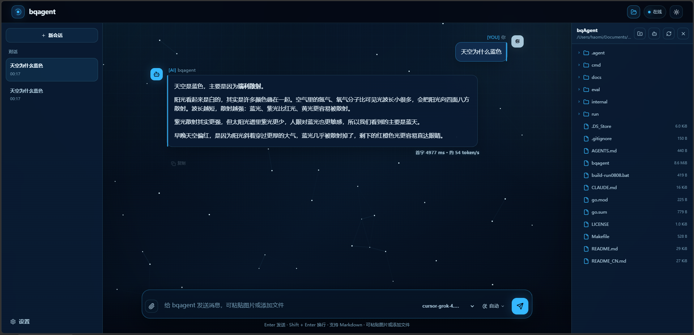

# bqagent

[中文](./README_CN.md) | English



> *"The question is not what you look at, but what you see."* — Henry David Thoreau

A small Go agent for local work, now with workspace-aware context, Markdown skill definitions, lightweight memory, planning, persistent sessions, request-time context management, checkpoint-based resume compaction, and a minimal background mode.

## What it can do

bqagent still keeps the same core loop:

1. send messages through OpenAI Chat Completions, OpenAI Responses, or Anthropic Messages
2. let the model choose tools
3. run the tools locally
4. return tool results to the model
5. repeat until the task is done

The difference now is that the loop can be wrapped with extra capabilities inspired by `agent-claudecode.py` and OpenClaw:

- workspace-rooted system prompt assembly
- primary `.agent/` workspace layout with `AGENT.md`, `SOUL.md`, `TOOLS.md`, and `USER.md`
- continued support for `.agent/rules/*.md` and `.agent/skills/*/SKILL.md`
- optional planning with `--plan`
- inline, always-streaming terminal TUI by default (also available with `--chat`); see the [TUI guide](./docs/TUI.md)
- persistent sessions with `--resume`
- request-time context pruning for long conversations
- optional request-time summary compaction for older turns
- checkpoint-based compact resume while keeping raw session history intact
- minimal background execution with `--background`
- a long-lived HTTP server with `--server`, including optional ServerChan reply delivery

## Install

Install Go 1.24+, Node.js 24+, and npm 11+, then build through the Makefile:

```bash
make build
```

`make build` installs the locked frontend dependencies from `internal/server/webui/package-lock.json`, runs strict TypeScript checking and the Vite production build, and then embeds `internal/server/webui/dist` into the Go executable. `dist` and `node_modules` are not committed. Runtime distribution still consists of one `bqagent` binary and does not require Node.js, Vite, a CDN, or static files on disk. Use `make build-amd` for Linux amd64 and `make build-windows` for Windows amd64.

For WebUI-only development, run `npm run dev` in `internal/server/webui`; Vite proxies `/api` to `http://127.0.0.1:8080`. On a fresh checkout, do not invoke the raw `go build` command before generating the WebUI. Run `make webui-build` first or use one of the Makefile build targets above.

## Environment variables

bqagent reads configuration from the process environment and from a `.env` file in the workspace root. Values already present in the process environment take precedence over `.env`. Loaded `.env` values are also exported to the process environment so shell tools and external-agent child processes inherit them.

The workspace `.env` format is recommended:

```dotenv
LLM_API_TYPE=openai
LLM_API_KEY=your-key-here
LLM_BASE_URL=https://api.openai.com/v1
LLM_MODEL=gpt-4o-mini
LLM_MODELS=gpt-4o-mini,fast=gpt-5.1
```

The same variables can be set directly in a shell:

**macOS/Linux:**
```bash
export LLM_API_KEY='your-key-here'
```

**Windows (PowerShell):**
```powershell
$env:LLM_API_KEY='your-key-here'
```

**Windows (CMD):**
```cmd
set LLM_API_KEY=your-key-here
```

### LLM provider

Single-run tasks, Chat, background tasks, subagent workers, and Server all prefer the active provider in global `~/.agent/config.json`; environment variables are used only when no active provider is configured.

Generic `LLM_*` values take precedence over provider-specific compatibility variables.

| Variable | Default | Description |
|---|---|---|
| `LLM_API_TYPE` | `openai` | Wire protocol: `openai`, `openai-response`, or `anthropic`. |
| `LLM_API_KEY` | — | Generic API key. Required in server mode. |
| `LLM_BASE_URL` | provider default | Generic provider endpoint override. |
| `LLM_MODEL` | empty | Model ID for the built-in LLM provider; configure it explicitly. |
| `LLM_MODELS` | empty | Comma-separated switchable models for the same provider; supports `alias=model-id`. Use `/model` to list, `/model <name-or-alias>` to switch the current session, and `/model default` to restore the default. |
| `LLM_STREAM_IDLE_TIMEOUT` | `2m` | Idle watchdog for streaming model requests while no response headers or body bytes arrive. Uses Go duration syntax; set to `0` to disable. |
| `OPENAI_API_TYPE` | — | Compatibility alias for `LLM_API_TYPE`. |
| `OPENAI_API_KEY` | — | OpenAI-compatible API key fallback. |
| `OPENAI_BASE_URL` | provider default | OpenAI-compatible endpoint fallback. |
| `OPENAI_MODEL` | — | OpenAI-compatible model fallback. |
| `ANTHROPIC_API_KEY` | — | Anthropic key fallback when the API type is `anthropic`. |
| `ANTHROPIC_BASE_URL` | provider default | Anthropic endpoint fallback. |
| `ANTHROPIC_MODEL` | — | Anthropic model fallback. |

OpenAI Responses API example:

```dotenv
LLM_API_TYPE=openai-response
LLM_API_KEY=your-key-here
LLM_BASE_URL=https://api.openai.com/v1
LLM_MODEL=gpt-5
```

Anthropic Messages API example:

```dotenv
LLM_API_TYPE=anthropic
LLM_API_KEY=your-key-here
LLM_BASE_URL=https://api.anthropic.com/v1
LLM_MODEL=claude-sonnet-4-5
```

The effective model and API type are injected into every built-in LLM system prompt and exposed without secrets by `GET /api/v1/status`.

### Search

| Variable | Default | Description |
|---|---|---|
| `SEARCH_API_KEY` | — | Tavily-compatible search key; takes precedence over Firecrawl settings. |
| `SEARCH_BASE_URL` | provider default | Tavily-compatible endpoint override. |
| `FIRECRAWL_API_KEY` | — | Firecrawl key used when `SEARCH_*` is not configured. |
| `FIRECRAWL_BASE_URL` | provider default | Firecrawl endpoint override. |

### MCP

| Variable | Default | Description |
|---|---|---|
| `MCP_ALLOWED_ENV` | empty | Comma-separated process-level allowlist for `${NAME}` / `$NAME` references in `.agent/mcp.json` header values. |

Set `MCP_ALLOWED_ENV` before using placeholders in `.agent/mcp.json` header values, for example `MCP_ALLOWED_ENV=DASHSCOPE_API_KEY`. URL values never expand environment variables; unlisted, undefined, or malformed placeholders cause only that MCP server to be skipped.

### Server and channels

| Variable | Default | Description |
|---|---|---|
| `WEBUI_ENABLED` | `true` | Set to `false`, `0`, `no`, or `off` to disable `GET /`. |
| `SERVERCHAN_BOT_TOKEN` | — | Token used by the ServerChan Bot webhook reply path. |
| `SERVERCHAN_BOT_WEBHOOK_SECRET` | — | Required non-blank value for `X-Sc3Bot-Webhook-Secret`; without it the bot webhook endpoint returns `503`. |
| `QQ_BOT_ENABLED` | automatic | QQ is enabled when credentials exist; false-like values force-disable it. |
| `QQ_BOT_APP_ID` | — | QQ Bot application ID. |
| `QQ_BOT_CLIENT_SECRET` | — | QQ Bot client secret. |
| `QQ_BOT_TOKEN_BASE_URL` | `https://bots.qq.com` | QQ token endpoint override. |
| `QQ_BOT_API_BASE_URL` | `https://api.sgroup.qq.com` | QQ API and gateway endpoint override. |
| `WEIXIN_ILINK_ENABLED` | `true` | Set to a false-like value to disable the WeChat iLink channel. |
| `WEIXIN_ILINK_BASE_URL` | `https://ilinkai.weixin.qq.com` | iLink API endpoint override. |
| `WEIXIN_ILINK_CHANNEL_VERSION` | `1.0.2` | iLink channel protocol version. |
| `WEIXIN_ILINK_CDN_BASE_URL` | `https://novac2c.cdn.weixin.qq.com/c2c` | Inbound media CDN override. |

### Runtime, context, sessions, and tracing

| Variable | Default | Description |
|---|---|---|
| `AGENT_MAX_ITERATIONS` | `1000` | Global loop runaway safety limit. |
| `BASH_OUTPUT_MAX_BYTES` | `1048576` | Maximum combined stdout/stderr bytes retained by `execute_bash`; excess output is drained and discarded, then the result ends with a truncation marker. Non-positive or invalid values use the default. |
| `READ_FILE_MAX_BYTES` | `1048576` | Maximum file-content bytes returned by `read_file`; excess content is drained and discarded, then the result ends with a truncation marker. Non-positive or invalid values use the default. |
| `CHANNEL_AGENT_MAX_ITERATIONS` | `30` | Maximum iterations per turn for QQ, iLink, ServerChan Bot, and other message channels; does not limit WebUI. |
| `CHANNEL_TURN_TIMEOUT` | `10m` | Whole-turn timeout for QQ, iLink, ServerChan Bot, and other message channels; does not limit WebUI. |
| `CHANNEL_STAGE_MAX_ITERATIONS` | `20` | QQ/iLink iterations before a persisted stage checkpoint. |
| `CHANNEL_STAGE_TIMEOUT` | `90s` | QQ/iLink stage time budget. |
| `WEBUI_STAGE_MAX_ITERATIONS` | `0` (disabled) | Optional WebUI iteration budget before a stage checkpoint; enabled only by a positive value. |
| `WEBUI_STAGE_TIMEOUT` | `0` (disabled) | Optional WebUI stage time budget; enabled only by a positive duration. |
| `GROUP_EXTERNAL_AGENT_TIMEOUT` | `10m` | Independent timeout for each external Agent call in group chat; expiry cancels and invalidates the group's ACP session. |
| `WEBUI_WORKSPACE_ROOTS` | — | Additional server-side roots the WebUI may browse and select, separated with the OS path-list separator (`:` on Unix/macOS, `;` on Windows). The user home and startup workspace are always allowed. |
| `CONTEXT_MANAGEMENT_ENABLED` | `true` | Enables request-time context budgeting. |
| `CONTEXT_MAX_INPUT_TOKENS` | `132000` | Maximum estimated context budget, including the response reserve. |
| `CONTEXT_TARGET_INPUT_TOKENS` | `128000` | Target size after pruning or summarization. |
| `CONTEXT_RESPONSE_RESERVE_TOKENS` | `4000` | Tokens reserved for the model response. |
| `CONTEXT_KEEP_LAST_TURNS` | `6` | Recent turns retained during compaction. |
| `CONTEXT_EXACT_COUNT_TRIGGER_PERCENT` | `80` | Attempts provider-side exact counting (OpenAI Responses and Anthropic) after the full-request local/usage estimate reaches this percentage of the target; unsupported or failed counts fall back safely. |
| `CONTEXT_SUMMARIZATION_ENABLED` | `true` | Enables summarization of older dialogue. |
| `CONTEXT_SUMMARY_TRIGGER_TOKENS` | `128000` | Estimated input size that triggers summarization. |
| `CONTEXT_SUMMARY_MODEL` | main model | Optional cheaper model used for summaries. |
| `SESSION_TRANSCRIPT_MODE` | `compact` | `compact` bounds `messages.jsonl`; `full` keeps append-only audit history. |
| `SESSION_OUTPUT_MAX_BYTES` | `1048576` | Retained tail of each `output.log`; `0` disables trimming. |
| `RUN_TRACE_ENABLED` | `false` | Persists `.agent/runs/<run-id>/` traces and enables run feedback APIs. |

### External coding agents

For each name in `CLAUDE`, `CODEX`, `CURSOR`, and `OPENCODE`, `AGENT_<NAME>_ACP_CMD` and `AGENT_<NAME>_ACP_ARGS` override the ACP launch command. CLI transport is currently implemented only for Claude and Codex and can be overridden with `AGENT_<NAME>_CLI_CMD` and `AGENT_<NAME>_CLI_ARGS`.

Claude defaults to `claude -p --output-format json`; Codex defaults to `codex exec --json --skip-git-repo-check`. Cursor defaults to ACP via `cursor-agent acp`, and OpenCode defaults to ACP via `opencode acp`. The corresponding executable must be visible in the PATH of the process that starts bqAgent; restart a long-lived chat/server process after installing an external agent or changing its transport environment.

In `--chat` or `--server` sessions, use `/opencode <task>` to route the turn to OpenCode. Later messages remain bound to it until `/default` switches back to the built-in agent. OpenCode is ACP-only; configuring `AGENT_OPENCODE_CLI_CMD/ARGS` does not enable a CLI transport.

The WebUI's **New conversation** menu can also create a group conversation. Available external agents detected asynchronously after startup join bqagent in the initial roster; requests that need detection wait for that background probe without delaying service startup. The member bar can add currently available agents that were not part of the initial roster. Hovering an external member reveals a remove control; membership changes persist while prior messages and external session state remain available if that member is re-added. bqagent is the permanent coordinator and cannot be removed. A group task without a mention is handled directly by bqagent without consulting external members. A task addressed to `@codex`, `@opencode`, or another external member is handled directly by those members without bqagent analysis or synthesis. bqagent coordinates external agents and produces a final synthesis only when the user explicitly mentions `@bqagent`; a later `@bqagent` turn can also synthesize conclusions already in the shared context. Members run sequentially in the same workspace and receive the shared group context. Group conversations are Run-only. Existing sticky `/codex` and `/opencode` routing remains unchanged in ordinary conversations. The orchestration is channel-neutral, although this release exposes it only in the WebUI.

## Documentation

See the [project documentation](./docs/doc.md#english-documentation) for complete usage instructions and the [inline TUI guide](./docs/TUI.md) for shortcuts, commands, TTY fallback, and scrollback behavior.
